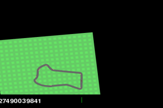
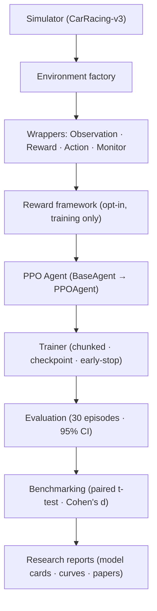
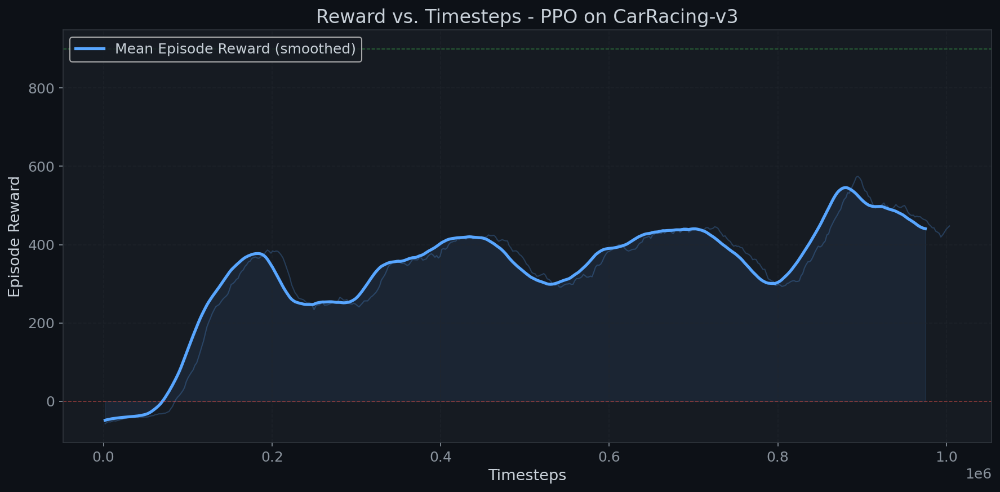
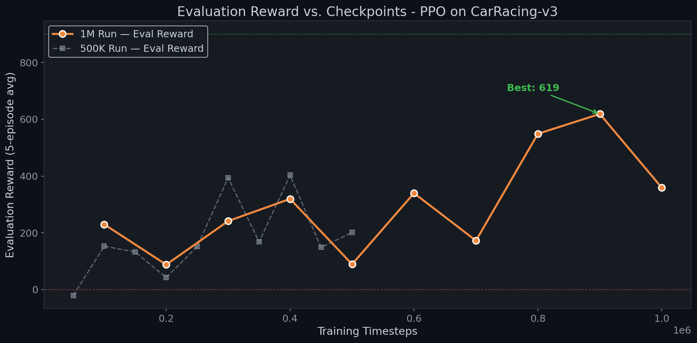
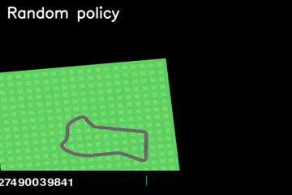

<div align="center">

# 🏎️ RaceMind AI

**A reproducible reinforcement-learning research platform for autonomous racing.**

Train, evaluate, and *scientifically* compare PPO agents on Gymnasium's `CarRacing-v3` — with a frozen baseline, controlled experiments, and honest statistics.


-orange.svg)


<br/>



*The frozen baseline PPO agent (mean reward **598.42**) driving `CarRacing-v3`.*

</div>

---

## Overview

RaceMind AI is an end-to-end reinforcement-learning **research platform**, not a
single training script. It provides a modular simulator, a PPO training stack, a
statistical evaluation and benchmarking suite, a controlled-experiment framework,
and a modular reward-shaping framework — all built to answer one question rigorously:

> **Does a given change actually improve the agent — and can we prove it?**

Every training run is treated as a controlled experiment: exactly one variable
changes, everything else matches a **frozen baseline**, and the result is judged by
a paired statistical test with a clear verdict (*Improved / No significant change /
Regressed*).

## Motivation

PPO is high-variance. On a limited (CPU) compute budget, informal single-run
comparisons routinely mislead. RaceMind AI was built to make RL claims *falsifiable*:
a permanent baseline, a fixed evaluation protocol (30 deterministic episodes, fixed
seeds), paired t-tests, confidence intervals, and effect sizes — so that "this helps"
is a measurement, not a hunch.

## Key features

- 🧩 **Layered, interface-driven architecture** — algorithms and rewards are pluggable.
- 🚗 **Simulator toolkit** — env factory, manual driving, telemetry, recording, replay.
- 🤖 **PPO pipeline** (Stable-Baselines3) with an algorithm-agnostic chunked trainer:
  periodic eval, best/latest checkpointing, resume-continuity, plateau early-stopping.
- 📊 **Rigorous evaluation** — 30-episode fixed-seed protocol, 95% CIs, paired t-tests,
  Cohen's d, automatic verdicts vs. a frozen baseline.
- 🔬 **Controlled experiments** — auto specs, model cards, learning curves, videos,
  and generated research papers.
- 🎛️ **Modular reward framework** — YAML-configurable, composable reward components
  with per-component logging and plots (training-only, baseline stays comparable).
- 📁 **Reproducibility** — global seeding, immutable baseline, structured archives,
  TensorBoard, JSON + Markdown reports.

## Architecture



More detail in [`docs/architecture.md`](docs/architecture.md).

## Folder structure

```
racemind-ai/
├── simulator/      # CarRacing-v3 wrapper, factory, wrappers, telemetry, replay
├── agents/         # BaseAgent interface, PPOAgent (SB3), RandomAgent
├── training/       # trainer, checkpoint manager, training loop, callbacks
├── evaluation/     # evaluator, statistics (95% CI), benchmark, model cards, plots
├── reward/         # modular reward framework (components, manager, shaping, plots)
├── research/       # baseline, experiment specs, comparison, papers, reports
├── experiments/    # experiment runner, sweep, registry, ranking
├── config/         # simulator / RL / logging / paths configuration
├── configs/        # YAML: ppo, simulator, evaluation, reward_*
├── utils/          # logging, seeding, io, paths, git info
├── docs/           # architecture, training, evaluation, experiments, reward, assets
├── data/           # generated telemetry / recordings / checkpoints (git-ignored)
└── *.py            # training & evaluation entry-point scripts
```

## Installation

Requires **Python 3.12+**.

```bash
git clone <your-fork-url> racemind-ai && cd racemind-ai
python -m venv .venv
.venv\Scripts\Activate.ps1        # Windows
# source .venv/bin/activate       # macOS / Linux
pip install -r requirements.txt
```

> Box2D ships as a pre-built wheel, so no C++ toolchain is needed.

## Quick start

```bash
# See the environment run (random policy)
python -m simulator.env

# Drive it yourself (arrow keys)
python -m simulator.manual_drive

# Tiny end-to-end training smoke test
python train_smoke_test.py
```

## Training

```bash
python train_100k.py          # scale-up runs
python train_1m.py            # baseline-scale run (~hours on CPU)
tensorboard --logdir runs     # watch progress
```

Hyperparameters live in `configs/ppo.yaml`. See [`docs/training.md`](docs/training.md).

## Evaluation

```bash
python evaluate_best.py        # evaluate a best checkpoint
python compare_checkpoints.py  # high-confidence 30-episode head-to-head
python watch_agent.py          # record a video of a trained agent
```

The evaluation protocol is fixed and native-reward-only. See
[`docs/evaluation.md`](docs/evaluation.md).

## Experiment workflow

```bash
python run_experiment_001.py                                   # LR-schedule study
python -m research.run_reward_experiment --config configs/reward_smooth_steering.yaml
```

One variable changes; everything else matches the baseline; a paired comparison and
a research paper are produced automatically. See [`docs/experiments.md`](docs/experiments.md).

## Benchmark methodology

- **30 deterministic episodes**, fixed seeds 1000–1029, native task reward.
- **Paired t-test** vs. the frozen baseline (shared seeds ⇒ pairing), **Cohen's d**,
  and non-overlapping 95% CIs as a conservative check.
- Verdict: **Improved / No significant change / Regressed**.

## Results

Frozen baseline: **mean reward 598.42**, 95% CI [544.78, 652.05] (30 episodes).

| Experiment | Change | Mean | Δ | Verdict |
| --- | --- | ---: | ---: | :---: |
| **Baseline PPO** | — | **598.42** | — | ✅ baseline |
| Continue Training | +1M→3M steps | 420.94 | −29.7% | ❌ Regressed |
| Learning-Rate Schedule | constant → linear decay | 434.10 | −27.5% | ❌ Regressed |
| RGB FrameStack | 1 → 4 frames | 411.07 | −31.3% | ❌ Regressed |

Full tables and statistics: [`research/results_summary.md`](research/results_summary.md).

## Training progress

The baseline PPO agent climbing over 1,000,000 steps — training reward and
evaluation reward at each checkpoint:

<p align="center">
  
  
</p>

### Learning journey

From a random policy to the trained agent — the same seed at four training stages:

<div align="center">
  
</div>

## Research findings

**Every controlled change tested so far regressed against the baseline** at the fixed
CPU budget. We report this honestly:

- *Continued training* and the *LR schedule* drifted a converged policy downward
  (the regression appears before decay takes effect — a continuation confound).
- *Frame stacking* quadrupled the input to 12 channels, trained ~5× slower, and was
  still improving at 1M steps — i.e. undertrained and confounded by channel count.

No easy win was found. The value here is the **method**: reproducible, statistically
tested, honestly reported negatives. See the write-up in
[`research/final_report.md`](research/final_report.md) and the honest per-experiment
papers in `research/experiments/`.

## Videos

Videos of trained policies are generated locally (git-ignored to keep the repo light):

```bash
python watch_agent.py     # → research/experiments/<id>/videos/*.mp4
```

See [`docs/assets.md`](docs/assets.md) for where every artifact lives.

## Future work

- Multi-seed runs for variance estimates and higher statistical power.
- Grayscale + FrameStack(4) to isolate temporal information from channel count.
- Complete the staged reward ablations (SmoothSteering, +IdlePenalty).
- GPU training to lift the compute ceiling.

## Acknowledgements

Built on [Gymnasium](https://gymnasium.farama.org/) (`CarRacing-v3`),
[Stable-Baselines3](https://stable-baselines3.readthedocs.io/), and PyTorch. Thanks
to the Farama Foundation and the SB3 maintainers.

## License

Released under the [MIT License](LICENSE).
