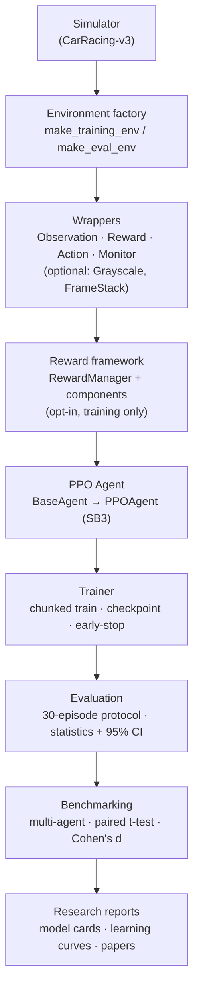
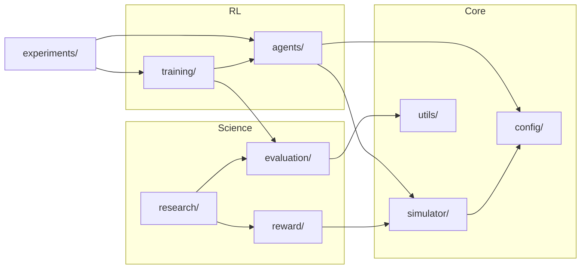

# Architecture

RaceMind AI is layered so that each stage depends only on the interface below it.
The reward framework and the agent are both **pluggable**, and evaluation is
decoupled from training — which is what makes controlled experiments possible.

## System pipeline

## Package map

## Design principles

- **Single environment creation point** (`simulator.environment_factory`) — every
  env is built here, so wrapping and configuration change in exactly one place.
- **Interface-driven training** — the trainer, evaluator and benchmark suite touch
  only `BaseAgent`; PPO specifics live inside `PPOAgent`. A new algorithm plugs in
  without touching them.
- **Evaluation is decoupled from training** — always the native task reward, 30
  deterministic episodes, fixed seeds. Reward shaping applies to *training only*,
  so every experiment stays comparable to the frozen baseline.
- **Config over code** — simulator, RL, evaluation and reward settings live in
  YAML; changing an experiment does not require editing Python.
- **Reproducibility first** — global seeding, immutable frozen baseline, archived
  specs, model cards, and paired statistical comparison for every run.

See [`training.md`](training.md), [`evaluation.md`](evaluation.md),
[`experiments.md`](experiments.md) and [`reward_framework.md`](reward_framework.md)
for each subsystem.
